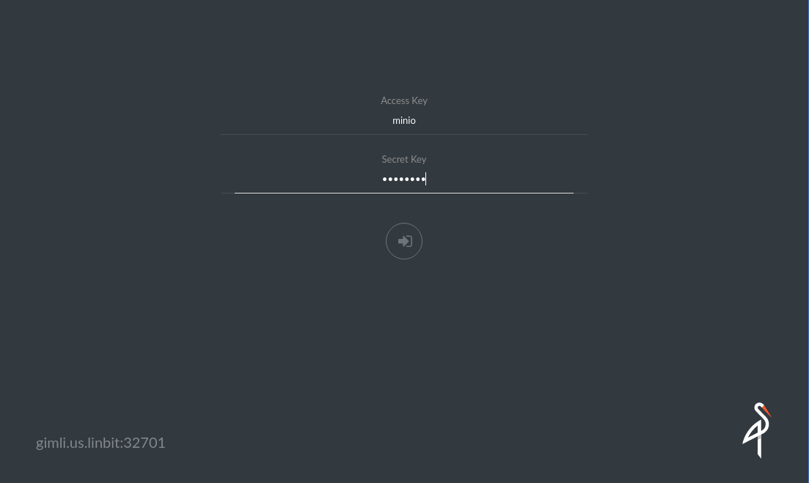
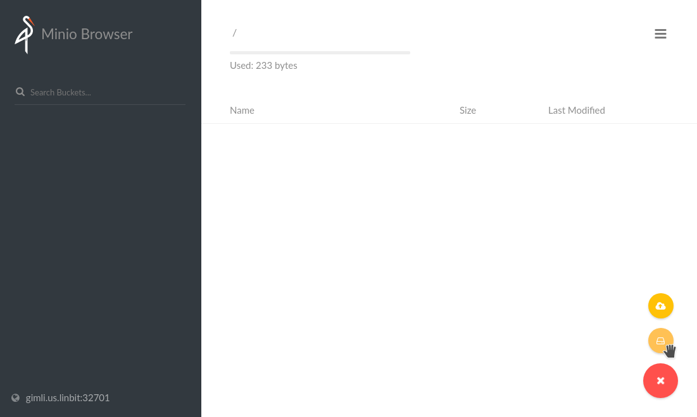
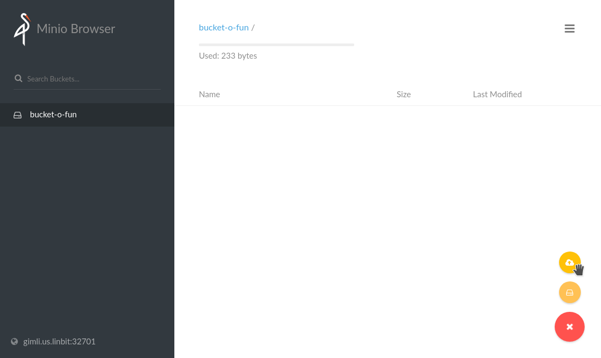
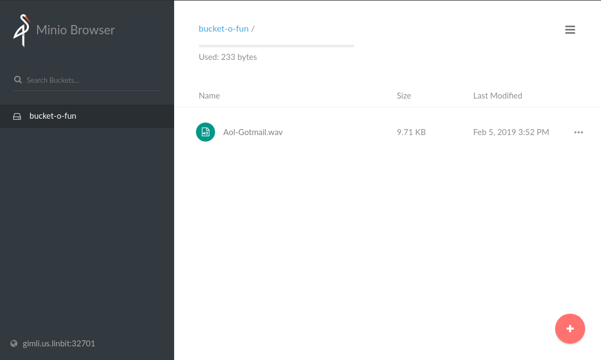

## Minio Server on LINSTOR Provisioned PV

Refer to https://docs.minio.io/ to learn about minio 

### Apply the minio deployment spec

```
$ kubectl apply -f minio.yaml
```

Verify that the minio deployment and service are running successfully with LINSTOR provioned PV

```
$ kubectl get pods
NAME                                READY   STATUS    RESTARTS   AGE
minio-deployment-595cfb778f-mqlvw   1/1     Running   0          9m58s

$ kubectl get svc
NAME            TYPE        CLUSTER-IP    EXTERNAL-IP   PORT(S)          AGE
kubernetes      ClusterIP   10.96.0.1     <none>        443/TCP          18d
minio-service   NodePort    10.96.30.40   <none>        9000:32701/TCP   10m

$ kubectl get pvc
NAME             STATUS   VOLUME                                     CAPACITY   ACCESS MODES   STORAGECLASS                         AGE
minio-pv-claim   Bound    pvc-88a43d72-267b-11e9-8b47-a4badb334bb6   10Gi       RWO            csi-one-replica-autoplace-thin-lvm   10m
```

### Verify you can upload data to Minio
  
In a browser, navigate to the IP address of any node in the cluster at the exposed port (32701 in the example above) and login using the default credentials:
*Access Key* : *minio*
*Secret key* : *minio123*



Minio has similar functionality to S3: file uploads, creating buckets, and storing other data. 

Use the icon at *bottom-right* of the screen to create a bucket and upload a file.


 


Verify that the file-upload is successful 


